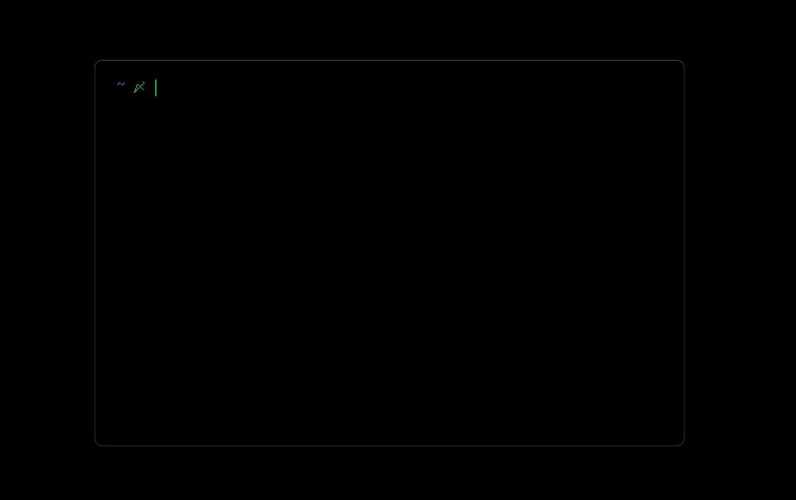

<!-- DO NOT REMOVE - contributor_list:data:start:["Matt-Gleich"]:end -->

# ctree

🎄 Christmas tree right from your terminal!


## 👀 Demo



## ⌛ No Refresh

Don't want the tree to refresh every 2 seconds? Easy! Just add the `--no-refresh` flag when you run ctree.

## 🚀 Installing ctree

### 🍎 macOS

```bash
brew install Matt-Gleich/homebrew-taps/ctree
```

### 🐧 Linux and 🖥 Windows

You can grab the binary from the [latest release](https://github.com/Matt-Gleich/ctree/releases/latest)

## 🙌 Contributing

Before contributing please read the [CONTRIBUTING.md file](https://github.com/Matt-Gleich/ctree/blob/master/CONTRIBUTING.md)

<!-- DO NOT REMOVE - contributor_list:start -->

## 👥 Contributors

- **[@Matt-Gleich](https://github.com/Matt-Gleich)**

<!-- DO NOT REMOVE - contributor_list:end -->
